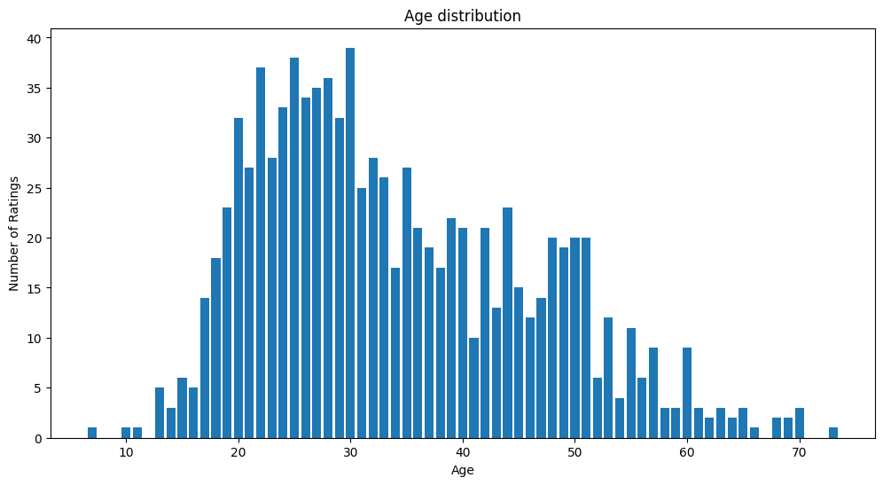
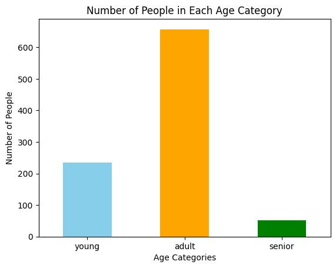
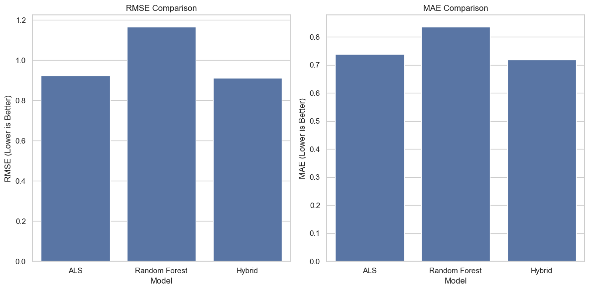

# Introduction
In the rapidly evolving landscape of digital content, recommendation systems have become an indispensable tool in personalizing user experiences. This project aims to develop a hybrid recommendation system that merges the strengths of two distinct approaches: Alternating Least Squares (ALS) for collaborative filtering and Random Forest for content-based predictions. This system is designed to address these challenges by leveraging the synergies between collaborative and content-based methods, offering a nuanced solution that is adaptable to both popular and niche user interests.
# Data analysis
First of all, I checked the u.data file. There, I decided to drop the timestamp column, because I can't use it in any way in the ALS approach, I just need the movies, users and their respective ratings. Furthermore, I decided not to clean data from the movies that have a small amount of ratings, because ALS is designed to handle sparse matrices, and it would be a waste of opportunity not to leverage recommendations of "long tail" items - those that may not be hugely popular but are highly relevant to a subset of users. Dropping movies with fewer ratings might exclude these niche but potentially valuable recommendations. 
After that, I checked the u.item dataset and cleared the `video_release_date` column since it had only NaNs in it. Also, I dropped the `IMDb_URL, title, release_date` columns, since they are unique values (apart from the release_date, which I just didn't use in the model).  
Finally, I opened the u.user dataset which contains the users' demographic data, and one-hot encoded `gender` and `occupation` columns. Furthermore, I dropped the zip code column, since my models don't really take your geographic location into account. Then, I decided to one-hot encode age as well, splitting the ages into groups: young people (age less than 25), adults (25-55), and seniors (55+). Initially, I wanted to split the age groups into real age groups (young people are people less than 20, and seniors are older than 60), but after looking at the age distribution, I realised that this would make this very unbalanced, so I shifted the groups a bit.    However, I can't make them very balanced, as this would mean that adults young people are until 30, and seniors start at 40, which makes no sense in the real life. So, I have the following distribution:   It's still unbalanced, but that's better than the initial distribution. 
Also, it is worth noting that I saved all the files in .parquet format after preprocessing, saving disk space and making data retrieval more optimized.
 
For training and testing I used the [u1.base](../data/raw/ml-100k/u1.base) and the [u1.test](../data/raw/ml-100k/u1.test), as this is the split that is used to evaluate the model based on my findings online: [here is the leaderboard](https://paperswithcode.com/sota/collaborative-filtering-on-movielens-100k)

# Model Implementation
For the model, I decided to go with a hybrid approach, using ALS for collaborative filtering, and Random Forest to handle the content-based predictions, which are the ones based on the demographics. So, my ALS and Random Forest algorithms predicted ratings, and after getting both ratings, I did the following math: `final_rating = als_coeff * als_ratings + rf_coeff * rf_ratings`, where `als_coeff` and `rf_coeff` are the coefficients I got using a Linear Regression model. Initially, I tried just averaging the values, but it worsened the performance compared to just using ALS, as Random Forest gave worse predictions. Combining the values in such a smart way allows the RF model to partially fix the disadvantages of the ALS approach, such as cold-starting.  
Here are the reasons why I chose ALS in my collaborative filtering:
1) It is better than a user-based approach, because user-based doesn't scale well.
2) It is better than a item-based approach, because item-based handles sparse matrices worse than ALS.
3) It is better than other matrix techniques, such as SVD, because SVD doesn't "like" missing data and doesn't scale as well as ALS does.
4) It is better than Deep Learning, because DL is too complex and would require a lot of compute, while the ALS approach is much more intuitive and easier to implement (just using pyspark is easy!).
   
Here are the reasons why I chose the Random Forest approach in my content-based predictions:
1) It is robust to overfitting.
2) It can be computed quickly because it is easy to parallelize.
3) It can handle diverse data types, like categorical, numerical and binary.
# Model Advantages and Disadvantages
**Advantages:**
1) Leveraging strengths of both approaches: 
    - Collaborative Filtering (ALS): Captures user-item interactions and can recommend items based on the preferences of similar users.
    - Content-Based Filtering (Random Forest): Utilizes user demographic data, which helps in personalizing recommendations based on individual user characteristics.
2) Robustness to Sparse Data:
   - ALS is particularly effective in dealing with sparse datasets, which is a common issue in user-item matrices.
3) Mitigating Cold Start Problem:
   - The content-based component (Random Forest) can help in addressing the cold start problem for new users by leveraging their demographic data.

**Disadvantages:**
1) Complexity and Resource Intensity:
   - Implementing and maintaining a hybrid system is more complex than using a single approach. It may require more computational resources, especially in the training and tuning phases.
2) Data Dependencies:
   - The effectiveness of the content-based component heavily relies on the availability and quality of user demographic data. Inaccuracies or biases in this data can skew recommendations. For example, I didn't address the imbalance in the age distribution (mentioned in the Data analysis).
3) Potential Performance Increase:
   - I assume that trying a state-of-the-art solution like GNN would bring more accurate recommendations, and I didn't implement it.
# Training Process
First of all, I needed to find a good set of hyperparameters for the models, so I ran grid search and cross-validated those values on ALS to find the best rank and regulatization parameter. I've chosen these hyperparameters, because they influence the result the most. Furthermore, to save computation time, I decided to make the max iteration parameter fixed. The best rank out of [10, 20, 30, 35, 40, 50] was 50, and the best regularization parameter out of [0.01, 0.025, 0.05, 0.1, 0.14, 0.15] turned out to be 0.14.  
After that, I chose the following parameter grid for Random Forest: `param_grid = {
    'n_estimators': [100, 200, 300],
    'max_depth': [None, 10, 20, 30],
    'min_samples_split': [2, 5, 10],
    'min_samples_leaf': [1, 2, 4]
}`. The chosen parameter grid for the Random Forest model, including n_estimators (100, 200, 300), max_depth (None, 10, 20, 30), min_samples_split (2, 5, 10), and min_samples_leaf (1, 2, 4), is designed to balance model complexity and performance. It aims to explore a range of configurations from simpler, less computationally intensive models to more complex ones, ensuring effective learning while avoiding overfitting. This grid serves as a comprehensive starting point for hyperparameter tuning to optimize the Random Forest for diverse datasets. 
After training both models, I saw that based on RMSE and MAE, ALS produced much better results than Random Forest, so I needed to combine both models somehow to make the hybrid approach perform better. As I mentioned in the Model Implementation section, I combined both approaches using coefficients that my linear regression model produced, and this improved the output!  
# Evaluation
I've chosen RMSE and MAE as my metrics, because RMSE is a widely used metric in recommendation systems, for example [here](https://paperswithcode.com/sota/collaborative-filtering-on-movielens-100). Furthermore, it is sensitive to large errors, which is perfect for ratings, as they are just from 0 to 5. MAE was chosen to complement RMSE, as RMSE amplifies large errors, but MAE provides an average error level. I didn't use precision @ k or recall @ k, because the primary purpose of my models was to generate ratings, and only based on them do I provide recommendations by sorting ratings in descending order (check evaluate.py for more details about the implementation). 
   These are the results for 3 approaches - ALS, RF and the hybrid model. As we can see, the hybrid model performs the best, boasting an RMSE of just 0.9108300704330717 and an MAE of 0.7186688314985312. If we compare the result to [state of the art results](https://paperswithcode.com/sota/collaborative-filtering-on-movielens-100k), we can see that my model performed pretty well based on the RMSE metric - it's somewhere around 10th place on that leaderboard.
# Results
The hybrid recommendation system, combining ALS for collaborative filtering and Random Forest for content-based predictions, shows promising results. It achieves an RMSE of 0.9108 and an MAE of 0.7187, indicating strong predictive accuracy. This performance places it competitively among existing recommendation models, particularly highlighting its effectiveness in sparse data situations and addressing the cold-start problem. These results underscore the potential of hybrid approaches in recommendation systems and pave the way for future enhancements.